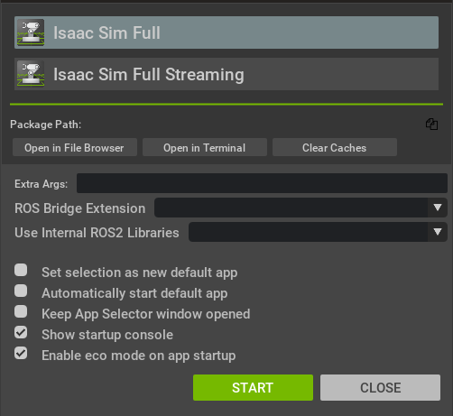

# Isaac Sim Tutorial
This repository is all about Isaac Sim Tutorial for Robot Simulation.

# Requirements

- Isaac Sim 4.5 **workstation**: Ubuntu 22.04, Nvidia Driver 535, Cuda 12.4, Python 3.10 and ROS2 Humble.
- Isaac Sim 4.5 **docker**: Ubuntu 24.04. Nvidia Driver 570, Cuda 12.6, Python 3.12 and ROS2 Jazzy.

# Installation

## Workstation Installation
The workstation installation of Isaac Sim is recommended for users who wants to run Isaac Sim as a GUI application on a Linux workstation with a GPU. Follow this website for more detailed [info](https://docs.isaacsim.omniverse.nvidia.com/latest/installation/install_workstation.html).

### Workstation Setup
Install Visual Studio Code to view and debug source code.
```bash
sudo snap install code
```
Download the 4.5 version of Isaac Sim to the default Downloads folder from this [website](https://docs.isaacsim.omniverse.nvidia.com/latest/installation/download.html).

```bash
mkdir ~/isaacsim
```
Unzip the package to the recommended Isaac Sim root folder:
```
cd ~/Downloads
unzip "isaac-sim-standalone@4.5.0-rc.36+release.19112.f59b3005.gl.linux-x86_64.release.zip" -d ~/isaacsim
```
The post_install script is used to create a symlink to the extension_examples folder for the tutorials. Run the Isaac Sim App Selector:
```bash
cd ~/isaacsim
./post_install.sh
./isaac-sim.selector.sh
```

The Isaac Sim app can be run directly via command line with 
```bash
./isaac-sim.sh
```

### Isaac Sim App Selector

The Isaac Sim App Selector is a mini-windowed app that helps run Isaac Sim in different modes. Click `START` to run the Isaac Sim main app.

<div align="center">
  
</div>

### Isaac Sim First Run

- Proceed to Getting Started Tutorials to begin the first Basic Tutorial.
- The first run of the Isaac Sim app takes some time to warm up the shader cache.
- To run Isaac Sim with a fresh config, use the `--reset-user` flag. This flag can be entered in the Extra Args section of the Isaac Sim App Selector or when running Isaac Sim in command line.

## Docker/Container Installation
The container installation of Isaac Sim is recommended for deployment on remote headless servers or the Cloud using a Docker container running Linux. Follow this website for more detailed [info](https://docs.isaacsim.omniverse.nvidia.com/latest/installation/install_container.html).

### Container Setup
Ensure your system meets the System Requirements and Driver Requirements for running NVIDIA Isaac Sim.

#### Install NVIDIA Driver:
```
sudo apt-get update
sudo apt install build-essential -y
wget https://us.download.nvidia.com/XFree86/Linux-x86_64/535.129.03/NVIDIA-Linux-x86_64-535.129.03.run
chmod +x NVIDIA-Linux-x86_64-535.129.03.run
sudo ./NVIDIA-Linux-x86_64-535.129.03.run
```

The recommended driver version for Isaac Sim is 535.129.03 for Linux.

#### Install Docker:
Docker installation using the convenience script:
```
curl -fsSL https://get.docker.com -o get-docker.sh
sudo sh get-docker.sh
```
Post-install steps for Docker:
```
sudo groupadd docker
sudo usermod -aG docker $USER
newgrp docker
```
Verify Docker:
```
docker run hello-world
```

#### Install the NVIDIA Container Toolkit:

Configure the repository:
```
curl -fsSL https://nvidia.github.io/libnvidia-container/gpgkey | sudo gpg --dearmor -o /usr/share/keyrings/nvidia-container-toolkit-keyring.gpg \
    && curl -s -L https://nvidia.github.io/libnvidia-container/stable/deb/nvidia-container-toolkit.list | \
    sed 's#deb https://#deb [signed-by=/usr/share/keyrings/nvidia-container-toolkit-keyring.gpg] https://#g' | \
    sudo tee /etc/apt/sources.list.d/nvidia-container-toolkit.list \
    && \
    sudo apt-get update
```
Install the NVIDIA Container Toolkit packages:
```
sudo apt-get install -y nvidia-container-toolkit
sudo systemctl restart docker
```
Configure the container runtime:
```
sudo nvidia-ctk runtime configure --runtime=docker
sudo systemctl restart docker
```
Verify NVIDIA Container Toolkit:
```
docker run --rm --runtime=nvidia --gpus all ubuntu nvidia-smi
```
### Container Deployment
This section describes how to run the NVIDIA Isaac Sim container.

Steps:

1. Setup and install the container prerequisites. See Container Setup above.

2. Run the following command to confirm your GPU driver version:
```
nvidia-smi
```
3. Pull the Isaac Sim Container:
```
docker pull nvcr.io/nvidia/isaac-sim:4.5.0
```
4. Run the Isaac Sim container with an interactive Bash session:
```
docker run --name isaac-sim --entrypoint bash -it --runtime=nvidia --gpus all -e "ACCEPT_EULA=Y" --rm --network=host \
    -e "PRIVACY_CONSENT=Y" \
    -v ~/docker/isaac-sim/cache/kit:/isaac-sim/kit/cache:rw \
    -v ~/docker/isaac-sim/cache/ov:/root/.cache/ov:rw \
    -v ~/docker/isaac-sim/cache/pip:/root/.cache/pip:rw \
    -v ~/docker/isaac-sim/cache/glcache:/root/.cache/nvidia/GLCache:rw \
    -v ~/docker/isaac-sim/cache/computecache:/root/.nv/ComputeCache:rw \
    -v ~/docker/isaac-sim/logs:/root/.nvidia-omniverse/logs:rw \
    -v ~/docker/isaac-sim/data:/root/.local/share/ov/data:rw \
    -v ~/docker/isaac-sim/documents:/root/Documents:rw \
    nvcr.io/nvidia/isaac-sim:4.5.0
```
- By using the -e "ACCEPT_EULA=Y" flag, you accept the license agreement of the image found at NVIDIA Omniverse License Agreement.
- By using the -e "PRIVACY_CONSENT=Y" flag, you opt-in to the data collection agreement found at Data Collection & Usage. You may opt-out by not setting this flag.
- The -e "PRIVACY_USERID=<email>" flag can optionally be set for tagging the session logs.
- The Isaac Sim container uses assets in the Cloud if no Nucleus server is available.

When using a separate Nucleus server:
- See Problem Connecting to Docker Container to expose all ports of the container and connect to an external Nucleus server.
- See Setting the Default Nucleus Server to set the default Nucleus server
- See Setting the Default Username and Password for Connecting to the Nucleus Server to set the default credentials for any Nucleus server.

5. Start Isaac Sim with native livestream mode:
```
./runheadless.sh -v
```
- Before running a livestream client, you must have the Isaac Sim app is loaded and ready. It may take a few minutes for Isaac Sim to completely load.
- The -v flag is used to show additional logs while the shader cache is being warmed up.
- To confirm this, look out for this line in the console or the logs:
```
Isaac Sim Full Streaming App is loaded.
```
- The first time loading Isaac Sim, it takes a while for the shaders to be cached. Subsequent runs of Isaac Sim are quicker because the shaders are cached and the cache is mounted when the container runs.
- See Save Isaac Sim Configs on Local Disk to make Isaac Sim configs and cache persistent when using containers.

6. Download and install the Isaac Sim WebRTC Streaming Client from the Latest Release section.

- Isaac Sim WebRTC Streaming Client is recommended to be used within the same network as an Isaac Sim headless instance.
- See Omniverse Streaming Client [DEPRECATED] for an alternative streaming client if you have issue livestreaming remotely in the Cloud.

7. Run the the Isaac Sim WebRTC Streaming Client.
8. Enter the IP address of the machine or instance running the Isaac Sim container and click on the Connect button to begin live streaming.
9. Proceed to Getting Started Tutorials to begin your first tutorial.

# Troubleshooting Installation
You can see something like this during post-installation process:
```
An input-output memory management unit (IOMMU) appears to be enabled on this system.
On bare-metal Linux systems, CUDA and the display driver do not support IOMMU-enabled PCIe peer to peer memory copy.
If you are on a bare-metal Linux system, please disable the IOMMU. Otherwise you risk image corruption and program instability.
This typically can be controlled via BIOS settings (Intel Virtualization Technology for Directed I/O (VT-d) or AMD I/O Virtualization Technology (AMD-Vi)) and kernel parameters (iommu, intel_iommu, amd_iommu).
Note that in virtual machines with GPU pass-through (vGPU) the IOMMU needs to be enabled.
Since we can not reliably detect whether this system is bare-metal or a virtual machine, we show this warning in any case when an IOMMU appears to be enabled.
```
Disable IOMMU (for bare-metal systems only):

- Disable VT-d or AMD-Vi in BIOS Reboot
- Enter BIOS/UEFI (usually Del, F2, or Esc)
- Find Intel VT-d or AMD-Vi under advanced settings
- Disable it
- Save and reboot

# Resources
- Isaac Sim 4.5 & Isaac Lab 2.0 | Installation & Overview | NVIDIA Omniverse [[video]](https://www.youtube.com/watch?v=CLFjtuH2NAQ)
- How to Install NVIDIA Isaac Sim [[video]](https://www.youtube.com/watch?v=SyrsAd8WbCo)
- Using Isaac Sim with ROS2: A Step-By-Step Guide [[video]](https://www.youtube.com/watch?v=L1rpxRm0Q1w)
- How I Use IsaacSim with Docker, ROS2, & Octomap for Robotics PhD Research [[video]](https://www.youtube.com/watch?v=9EkkdjW4N54)
- Isaac Sim in under half an hour [[video]](https://www.youtube.com/watch?v=SjVqOqEXXrY) 
- UR5 Inverse Kinematics + ROS2 Explained (Nvidia Omniverse Isaac Sim) [[video]](https://www.youtube.com/watch?v=DzKHEtwAOLU)
- Simulation took Control of my Robot Arm (NVIDIA Isaac Sim) [[video]](https://www.youtube.com/watch?v=Eb2zuQxOBlY)
- How to import my manipulator in Isaac Sim [[video]](https://www.youtube.com/watch?v=kRAZZ5OPZyM)
- How to Use MoveIt with Isaac Sim: A Step-by-Step Guide [[video]](https://www.youtube.com/watch?v=pGje2slp6-s)
- How to Utilize LeRobot, Isaac Sim and ROS2 [[video]](https://www.youtube.com/watch?v=eO5wMzw9LeQ)
- How We Build Digital Twins [[video]](https://www.youtube.com/watch?v=NGiNydrE8xU)
- How To Build Digital Twins In Omniverse Tutorial [[video]](https://www.youtube.com/watch?v=-Va2sXIHtaQ) 
